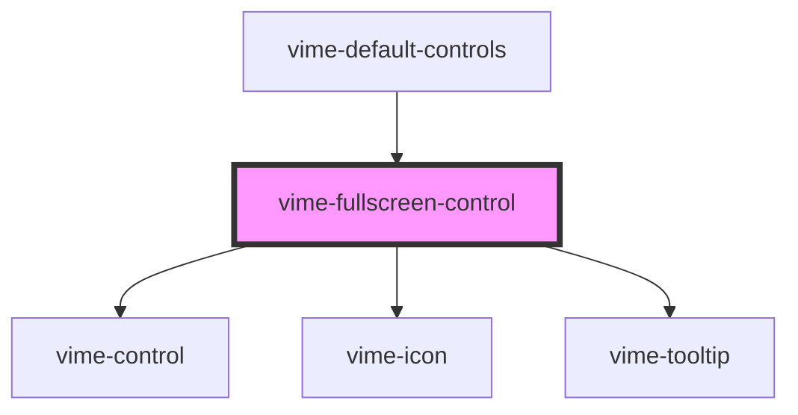

# vime-fullscreen-control

A control for toggling fullscreen mode. This control is not displayed if fullscreen cannot be
requested (checked via the `canSetFullscreen()` player method).

## Example

```html {6}
<vime-player>
  <!-- ... -->
  <vime-ui>
    <!-- ... -->
    <vime-controls>
      <vime-fullscreen-control></vime-fullscreen-control>
    </vime-controls>
  </vime-ui>
</vime-player>
```

<!-- Auto Generated Below -->

## Properties

| Property           | Attribute           | Description                                                                                                                                                   | Type                             | Default                    |
| ------------------ | ------------------- | ------------------------------------------------------------------------------------------------------------------------------------------------------------- | -------------------------------- | -------------------------- |
| `enterIcon`        | `enter-icon`        | The URL to an SVG element or fragment to display for entering fullscreen.                                                                                     | `string`                         | `'#vime-enter-fullscreen'` |
| `exitIcon`         | `exit-icon`         | The URL to an SVG element or fragment to display for exiting fullscreen.                                                                                      | `string`                         | `'#vime-exit-fullscreen'`  |
| `hideTooltip`      | `hide-tooltip`      | Whether the tooltip should not be displayed.                                                                                                                  | `boolean`                        | `false`                    |
| `keys`             | `keys`              | A slash (`/`) seperated string of JS keyboard keys (`KeyboardEvent.key`), that when caught in a `keydown` event, will trigger a `click` event on the control. | `string \| undefined`            | `'f'`                      |
| `scale`            | `scale`             | Scale the size of the control up/down by the amount given.                                                                                                    | `number`                         | `1`                        |
| `tooltipDirection` | `tooltip-direction` | The direction in which the tooltip should grow.                                                                                                               | `"left" \| "right" \| undefined` | `undefined`                |

## Dependencies

### Used by

- [vime-default-controls](../default-controls)

### Depends on

- [vime-control](../control)
- [vime-icon](../../icon)
- [vime-tooltip](../../tooltip)

### Graph



---

_Built with [StencilJS](https://stenciljs.com/)_
