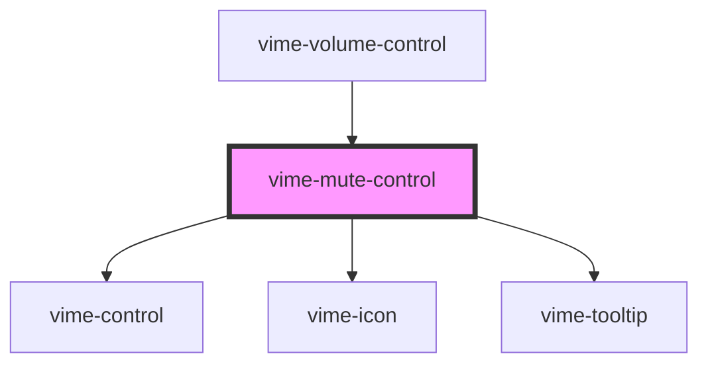

# vime-mute-control

A control for toggling whether there is audio output or not. In other words the muted state of 
the player.

## Example

```html
<vime-player>
  <!-- ... -->
  <vime-ui>
    <!-- ... -->
    <vime-controls>
      <vime-mute-control></vime-mute-control>
    </vime-controls>
  </vime-ui>
<vime-player>
```

<!-- Auto Generated Below -->


## Properties

| Property           | Attribute           | Description                                                                                                                                          | Type                             | Default               |
| ------------------ | ------------------- | ---------------------------------------------------------------------------------------------------------------------------------------------------- | -------------------------------- | --------------------- |
| `hideTooltip`      | `hide-tooltip`      | Whether the tooltip should not be displayed.                                                                                                         | `boolean`                        | `false`               |
| `highVolumeIcon`   | `high-volume-icon`  | The URL to an SVG element or fragment.                                                                                                               | `string`                         | `'#vime-volume-high'` |
| `keyCodes`         | `key-codes`         | A pipe (`\|`) seperated string of JS key codes, that when caught in a `keydown` event, will trigger a `click` event on the control.                  | `string \| undefined`            | `'77'`                |
| `keyboardHint`     | `keyboard-hint`     | If the `keyCodes` prop is provided, this prop can provide a hint to the user inside the tooltip for what keys can be pressed to trigger the control. | `string \| undefined`            | `'(m)'`               |
| `lowVolumeIcon`    | `low-volume-icon`   | The URL to an SVG element or fragment.                                                                                                               | `string`                         | `'#vime-volume-low'`  |
| `mutedIcon`        | `muted-icon`        | The URL to an SVG element or fragment.                                                                                                               | `string`                         | `'#vime-volume-mute'` |
| `tooltipDirection` | `tooltip-direction` | The direction in which the tooltip should grow.                                                                                                      | `"left" \| "right" \| undefined` | `undefined`           |


## Dependencies

### Used by

 - [vime-volume-control](../volume-control)

### Depends on

- [vime-control](../control)
- [vime-icon](../../icon)
- [vime-tooltip](../../tooltip)

### Graph


----------------------------------------------

*Built with [StencilJS](https://stenciljs.com/)*
