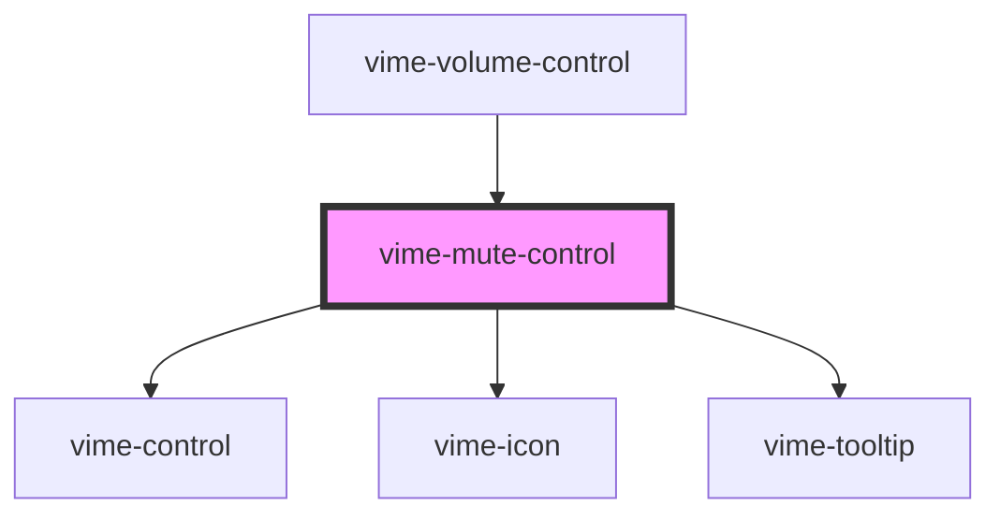

# vime-mute-control

A control for toggling whether there is audio output or not. In other words the muted state of
the player.

## Visual


<!-- Auto Generated Below -->


## Usage

### Angular

```html {7} title="example.html"
<vime-player>
  <!-- ... -->
  <vime-ui>
    <!-- ... -->
    <vime-controls>
      <!-- ... -->
      <vime-mute-control></vime-mute-control>
    </vime-controls>
  </vime-ui>
</vime-player>
```


### Html

```html {7}
<vime-player>
  <!-- ... -->
  <vime-ui>
    <!-- ... -->
    <vime-controls>
      <!-- ... -->
      <vime-mute-control></vime-mute-control>
    </vime-controls>
  </vime-ui>
</vime-player>
```


### React

```tsx {2,11}
import React from 'react';
import { VimePlayer, VimeUi, VimeControls, VimeMuteControl } from '@vime/react';

function Example() {
  return render(
    <VimePlayer>
      {/* ... */}
      <VimeUi>
        {/* ... */}
        <VimeControls>
          <VimeMuteControl />
        </VimeControls>
      </VimeUi>
    </VimePlayer>
  );
}
```


### Svelte

```html {6,16} title="example.svelte"
<VimePlayer>
  <!-- ... -->
  <VimeUi>
    <!-- ... -->
    <VimeControls>
      <VimeMuteControl />
    </VimeControls>
  </VimeUi>
</VimePlayer>

<script lang="ts">
  import {
    VimePlayer,
    VimeUi,
    VimeControls,
    VimeMuteControl,
  } from '@vime/svelte';
</script>
```


### Vue

```html {7,14,21} title="example.vue"
<template>
  <VimePlayer>
    <!-- ... -->
    <VimeUi>
      <!-- ... -->
      <VimeControls>
        <VimeMuteControl />
      </VimeControls>
    </VimeUi>
  </VimePlayer>
</template>

<script>
  import { VimePlayer, VimeUi, VimeControls, VimeMuteControl } from '@vime/vue';

  export default {
    components: {
      VimePlayer,
      VimeUi,
      VimeControls,
      VimeMuteControl,
    },
  };
</script>
```


## Properties

| Property           | Attribute           | Description                                                                                                                                                   | Type                             | Default               |
| ------------------ | ------------------- | ------------------------------------------------------------------------------------------------------------------------------------------------------------- | -------------------------------- | --------------------- |
| `hideTooltip`      | `hide-tooltip`      | Whether the tooltip should not be displayed.                                                                                                                  | `boolean`                        | `false`               |
| `highVolumeIcon`   | `high-volume-icon`  | The URL to an SVG element or fragment.                                                                                                                        | `string`                         | `'#vime-volume-high'` |
| `keys`             | `keys`              | A slash (`/`) separated string of JS keyboard keys (`KeyboardEvent.key`), that when caught in a `keydown` event, will trigger a `click` event on the control. | `string \| undefined`            | `'m'`                 |
| `lowVolumeIcon`    | `low-volume-icon`   | The URL to an SVG element or fragment.                                                                                                                        | `string`                         | `'#vime-volume-low'`  |
| `mutedIcon`        | `muted-icon`        | The URL to an SVG element or fragment.                                                                                                                        | `string`                         | `'#vime-volume-mute'` |
| `scale`            | `scale`             | Scale the size of the control up/down by the amount given.                                                                                                    | `number`                         | `1`                   |
| `tooltipDirection` | `tooltip-direction` | The direction in which the tooltip should grow.                                                                                                               | `"left" \| "right" \| undefined` | `undefined`           |


## Dependencies

### Used by

 - [vime-volume-control](../volume-control)

### Depends on

- [vime-control](../control)
- [vime-icon](../../icon)
- [vime-tooltip](../../tooltip)

### Graph


----------------------------------------------

*Built with [StencilJS](https://stenciljs.com/)*
