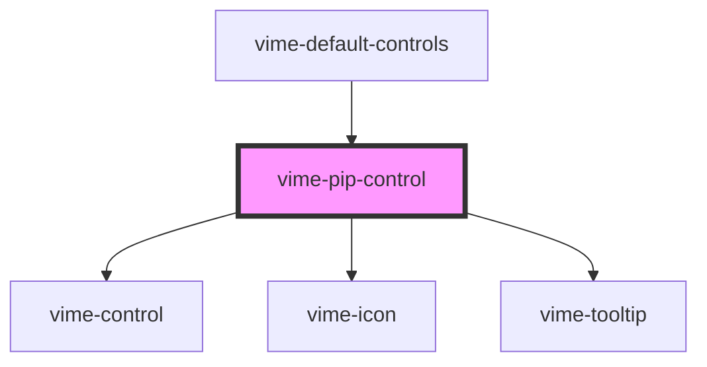

# vime-pip-control

A control for toggling picture-in-picture (PiP) mode. This control is not displayed if PiP cannot 
be requested (checked via the `canSetPiP()` player method).

## Example

```html
<vime-player>
  <!-- ... -->
  <vime-ui>
    <!-- ... -->
    <vime-controls>
      <vime-pip-control></vime-pip-control>
    </vime-controls>
  </vime-ui>
<vime-player>
```

<!-- Auto Generated Below -->


## Properties

| Property           | Attribute           | Description                                                                                                                                                   | Type                             | Default             |
| ------------------ | ------------------- | ------------------------------------------------------------------------------------------------------------------------------------------------------------- | -------------------------------- | ------------------- |
| `enterIcon`        | `enter-icon`        | The URL to an SVG element or fragment to display for entering PiP.                                                                                            | `string`                         | `'#vime-enter-pip'` |
| `exitIcon`         | `exit-icon`         | The URL to an SVG element or fragment to display for exiting PiP.                                                                                             | `string`                         | `'#vime-exit-pip'`  |
| `hideTooltip`      | `hide-tooltip`      | Whether the tooltip should not be displayed.                                                                                                                  | `boolean`                        | `false`             |
| `keys`             | `keys`              | A slash (`/`) seperated string of JS keyboard keys (`KeyboardEvent.key`), that when caught in a `keydown` event, will trigger a `click` event on the control. | `string \| undefined`            | `'p'`               |
| `scale`            | `scale`             | Scale the size of the control up/down by the amount given.                                                                                                    | `number`                         | `1`                 |
| `tooltipDirection` | `tooltip-direction` | The direction in which the tooltip should grow.                                                                                                               | `"left" \| "right" \| undefined` | `undefined`         |


## Dependencies

### Used by

 - [vime-default-controls](../default-controls)

### Depends on

- [vime-control](../control)
- [vime-icon](../../icon)
- [vime-tooltip](../../tooltip)

### Graph


----------------------------------------------

*Built with [StencilJS](https://stenciljs.com/)*
