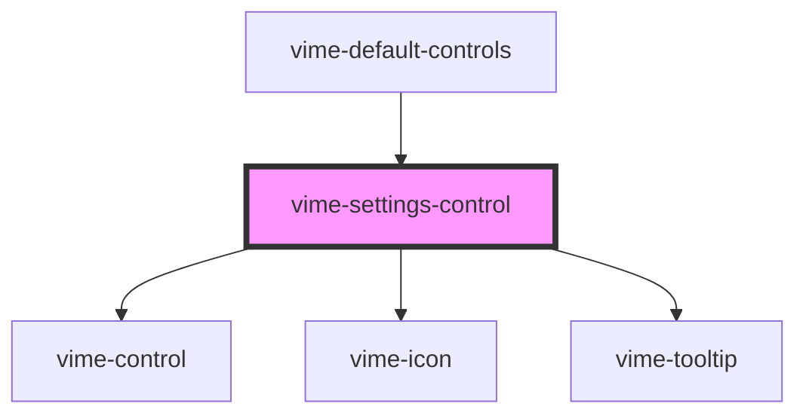

# vime-settings-control

A control for toggling the visiblity of the settings menu. This control is not displayed if no 
settings (`vime-settings`) has been provided for the current player.

## Example

```html
<vime-player>
  <!-- ... -->
  <vime-ui>
    <!-- ... -->
    <vime-controls>
      <vime-settings-control></vime-settings-control>
    </vime-controls>
  </vime-ui>
<vime-player>
```

<!-- Auto Generated Below -->


## Properties

| Property           | Attribute           | Description                                     | Type                             | Default            |
| ------------------ | ------------------- | ----------------------------------------------- | -------------------------------- | ------------------ |
| `hideTooltip`      | `hide-tooltip`      | Whether the tooltip should not be displayed.    | `boolean`                        | `false`            |
| `icon`             | `icon`              | The URL to an SVG element or fragment to load.  | `string`                         | `'#vime-settings'` |
| `tooltipDirection` | `tooltip-direction` | The direction in which the tooltip should grow. | `"left" \| "right" \| undefined` | `undefined`        |


## Dependencies

### Used by

 - [vime-default-controls](../default-controls)

### Depends on

- [vime-control](../control)
- [vime-icon](../../icon)
- [vime-tooltip](../../tooltip)

### Graph


----------------------------------------------

*Built with [StencilJS](https://stenciljs.com/)*
