# vime-default-ui

This component is a shorthand way to setup the entire default vime user interface, such as controls,
settings, captions and so on.

## Visuals

There are also alternative interfaces for live media, and the light player theme, but they're not
shown here for the sake of brevity.

### Audio


### Desktop Video


### Mobile Video


<!-- Auto Generated Below -->

## Usage

### Angular

```html {3} title="example.html"
<vime-player>
  <!-- ... -->
  <vime-default-ui></vime-default-ui>
</vime-player>
```

### Html

```html {3}
<vime-player>
  <!-- ... -->
  <vime-default-ui></vime-default-ui>
</vime-player>
```

### React

```tsx {2,8}
import React from 'react';
import { VimePlayer, VimeDefaultUi } from '@vime/react';

function Example() {
  return render(
    <VimePlayer>
      {/* ... */}
      <VimeDefaultUi />
    </VimePlayer>
  );
}
```

### Vue

```html {4,9,14} title="example.vue"
<template>
  <VimePlayer>
    <!-- ... -->
    <VimeDefaultUi />
  </VimePlayer>
</template>

<script>
  import { VimePlayer, VimeDefaultUi } from '@vime/vue';

  export default {
    components: {
      VimePlayer,
      VimeDefaultUi,
    },
  };
</script>
```

## Dependencies

### Depends on

- [vime-ui](../ui)
- [vime-icons](../icons)
- [vime-click-to-play](../click-to-play)
- [vime-captions](../captions)
- [vime-poster](../poster)
- [vime-spinner](../spinner)
- [vime-default-controls](../controls/default-controls)
- [vime-default-settings](../settings/default-settings)

### Graph

```mermaid
graph TD;
  vime-default-ui --> vime-ui
  vime-default-ui --> vime-icons
  vime-default-ui --> vime-click-to-play
  vime-default-ui --> vime-captions
  vime-default-ui --> vime-poster
  vime-default-ui --> vime-spinner
  vime-default-ui --> vime-default-controls
  vime-default-ui --> vime-default-settings
  vime-default-controls --> vime-controls
  vime-default-controls --> vime-playback-control
  vime-default-controls --> vime-volume-control
  vime-default-controls --> vime-current-time
  vime-default-controls --> vime-control-spacer
  vime-default-controls --> vime-scrubber-control
  vime-default-controls --> vime-live-indicator
  vime-default-controls --> vime-end-time
  vime-default-controls --> vime-settings-control
  vime-default-controls --> vime-control-group
  vime-default-controls --> vime-fullscreen-control
  vime-default-controls --> vime-scrim
  vime-default-controls --> vime-caption-control
  vime-default-controls --> vime-time-progress
  vime-default-controls --> vime-pip-control
  vime-playback-control --> vime-control
  vime-playback-control --> vime-icon
  vime-playback-control --> vime-tooltip
  vime-volume-control --> vime-mute-control
  vime-volume-control --> vime-slider
  vime-mute-control --> vime-control
  vime-mute-control --> vime-icon
  vime-mute-control --> vime-tooltip
  vime-current-time --> vime-time
  vime-scrubber-control --> vime-slider
  vime-scrubber-control --> vime-tooltip
  vime-end-time --> vime-time
  vime-settings-control --> vime-control
  vime-settings-control --> vime-icon
  vime-settings-control --> vime-tooltip
  vime-fullscreen-control --> vime-control
  vime-fullscreen-control --> vime-icon
  vime-fullscreen-control --> vime-tooltip
  vime-caption-control --> vime-control
  vime-caption-control --> vime-icon
  vime-caption-control --> vime-tooltip
  vime-time-progress --> vime-current-time
  vime-time-progress --> vime-end-time
  vime-pip-control --> vime-control
  vime-pip-control --> vime-icon
  vime-pip-control --> vime-tooltip
  vime-default-settings --> vime-menu-item
  vime-default-settings --> vime-menu-radio
  vime-default-settings --> vime-submenu
  vime-default-settings --> vime-menu-radio-group
  vime-default-settings --> vime-settings
  vime-menu-item --> vime-icon
  vime-menu-radio --> vime-menu-item
  vime-submenu --> vime-menu-item
  vime-submenu --> vime-menu
  vime-settings --> vime-menu
  style vime-default-ui fill:#f9f,stroke:#333,stroke-width:4px
```



---

_Built with [StencilJS](https://stenciljs.com/)_
