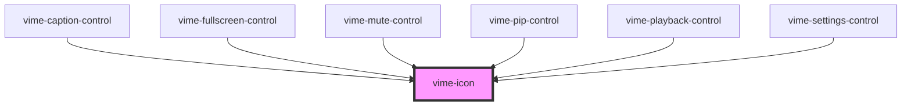

# vime-icon

Renders and displays an SVG icon. The SVG markup can be passed in directly or it can be loaded via 
a URL. It's preferrable to load a sprite via `vime-icons` and reference the icon using the `href` 
property.

## Example

```html
<!-- Markup -->
<vime-icon>
  <rect width="300" height="100" />
</vime-icon>

<!-- URL -->
<vime-icon href="#vime-play"></vime-icon>
```

<!-- Auto Generated Below -->


## Properties

| Property  | Attribute | Description                                                                       | Type                  | Default     |
| --------- | --------- | --------------------------------------------------------------------------------- | --------------------- | ----------- |
| `color`   | `color`   | The color (fill) of the icon.                                                     | `string \| undefined` | `undefined` |
| `href`    | `href`    | The URL to an SVG element or fragment to load.                                    | `string \| undefined` | `undefined` |
| `opacity` | `opacity` | The amount of transparency to add to the icon.                                    | `number`              | `1`         |
| `scale`   | `scale`   | The amount to scale the size of the icon (respecting aspect ratio) up or down by. | `number`              | `1`         |


## Slots

| Slot | Description                                            |
| ---- | ------------------------------------------------------ |
|      | Used to pass in SVG markup to be drawn by the browser. |


## CSS Custom Properties

| Name            | Description             |
| --------------- | ----------------------- |
| `--icon-height` | The height of the icon. |
| `--icon-width`  | The width of the icon.  |


## Dependencies

### Used by

 - [vime-caption-control](../controls/caption-control)
 - [vime-fullscreen-control](../controls/fullscreen-control)
 - [vime-mute-control](../controls/mute-control)
 - [vime-pip-control](../controls/pip-control)
 - [vime-playback-control](../controls/playback-control)
 - [vime-settings-control](../controls/settings-control)

### Graph


----------------------------------------------

*Built with [StencilJS](https://stenciljs.com/)*
