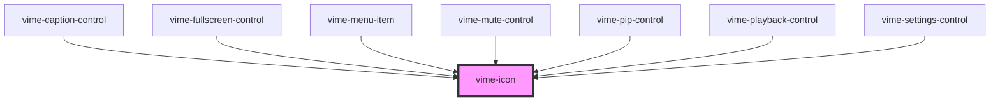

# vime-icon

Renders and displays an SVG icon. The SVG markup can be passed in directly or it can be loaded via
a URL. It's preferrable to load a sprite via `vime-icons` and reference the icon using the `href`
property.

<!-- Auto Generated Below -->


## Usage

### Angular

```html title="example.html"
<!-- Markup -->
<vime-icon>
  <rect width="400" height="200" />
</vime-icon>

<!-- URL -->
<vime-icon href="#vime-play"></vime-icon>
```


### Html

```html
<!-- Markup -->
<vime-icon>
  <rect width="300" height="100" />
</vime-icon>

<!-- URL -->
<vime-icon href="#vime-play"></vime-icon>
```


### React

```tsx {2,8-10,13}
import React from 'react';
import { VimeIcon } from '@vime/react';

function Example() {
  return (
    <div>
      {/* Markup */}
      <VimeIcon>
        <rect width="300" height="100" />
      </VimeIcon>

      {/* URL */}
      <VimeIcon href="#vime-play" />
    </div>
  );
}
```


### Svelte

```html {2-4,7,10} title="example.svelte"
<!-- Markup -->
<VimeIcon>
  <rect width="300" height="100" />
</VimeIcon>

<!-- URL -->
<VimeIcon href="#vime-play" />

<script lang="ts">
  import { VimeIcon } from '@vime/svelte';
<script>
```


### Vue

```html {4-6,9,14,18} title="example.vue"
<template>
  <div>
    <!-- Markup -->
    <VimeIcon>
      <rect width="300" height="100" />
    </VimeIcon>

    <!-- URL -->
    <VimeIcon href="#vime-play" />
  </div>
</template>

<script>
  import { VimeIcon } from '@vime/vue';

  export default {
    components: {
      VimeIcon,
    },
  };
</script>
```


## Properties

| Property | Attribute | Description                                    | Type                  | Default     |
| -------- | --------- | ---------------------------------------------- | --------------------- | ----------- |
| `href`   | `href`    | The URL to an SVG element or fragment to load. | `string \| undefined` | `undefined` |


## Slots

| Slot | Description                                            |
| ---- | ------------------------------------------------------ |
|      | Used to pass in SVG markup to be drawn by the browser. |


## CSS Custom Properties

| Name            | Description                                             |
| --------------- | ------------------------------------------------------- |
| `--icon-color`  | The color of the icon.                                  |
| `--icon-height` | The height of the icon.                                 |
| `--icon-scale`  | The amount to scale the size of the icon up or down by. |
| `--icon-width`  | The width of the icon.                                  |


## Dependencies

### Used by

 - [vime-caption-control](../controls/caption-control)
 - [vime-fullscreen-control](../controls/fullscreen-control)
 - [vime-menu-item](../settings/menu-item)
 - [vime-mute-control](../controls/mute-control)
 - [vime-pip-control](../controls/pip-control)
 - [vime-playback-control](../controls/playback-control)
 - [vime-settings-control](../controls/settings-control)

### Graph


----------------------------------------------

*Built with [StencilJS](https://stenciljs.com/)*
