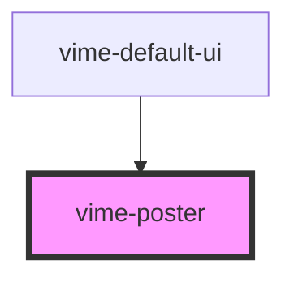

# vime-poster

Loads the poster set in the player prop `currentPoster` and displays it. The poster will automatically 
dissapear once playback starts.

## Example

```html
<vime-player>
  <!-- ... -->
  <vime-ui>
    <vime-poster></vime-poster>
  </vime-ui>
</vime-player>
```

<!-- Auto Generated Below -->


## Properties

| Property | Attribute | Description                                                                                   | Type                                                                    | Default   |
| -------- | --------- | --------------------------------------------------------------------------------------------- | ----------------------------------------------------------------------- | --------- |
| `fit`    | `fit`     | How the poster image should be resized to fit the container (sets the `object-fit` property). | `"contain" \| "cover" \| "fill" \| "none" \| "scale-down" \| undefined` | `'cover'` |


## Events

| Event      | Description                             | Type                |
| ---------- | --------------------------------------- | ------------------- |
| `loaded`   | Emitted when the poster has loaded.     | `CustomEvent<void>` |
| `willHide` | Emitted when the poster will be hidden. | `CustomEvent<void>` |
| `willShow` | Emitted when the poster will be shown.  | `CustomEvent<void>` |


## Dependencies

### Used by

 - [vime-default-ui](../default-ui)

### Graph


----------------------------------------------

*Built with [StencilJS](https://stenciljs.com/)*
