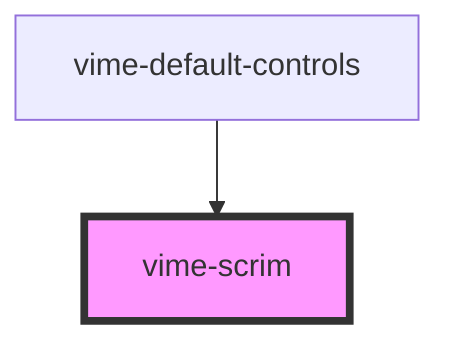

# vime-scrim

A darkened overlay that covers the current video to enable content placed on it to be more visible.

## Example

```html
<vime-player>
  <!-- ... -->
  <vime-ui>
    <vime-scrim active></vime-scrim>
  </vime-ui>
</vime-player>
```

<!-- Auto Generated Below -->


## Properties

| Property | Attribute | Description                          | Type      | Default |
| -------- | --------- | ------------------------------------ | --------- | ------- |
| `active` | `active`  | Whether the scrim is visible or not. | `boolean` | `false` |


## Events

| Event      | Description                            | Type                |
| ---------- | -------------------------------------- | ------------------- |
| `willHide` | Emitted when the scrim will be hidden. | `CustomEvent<void>` |
| `willShow` | Emitted when the scrim will be shown.  | `CustomEvent<void>` |


## CSS Custom Properties

| Name         | Description                        |
| ------------ | ---------------------------------- |
| `--scrim-bg` | The background color of the scrim. |


## Dependencies

### Used by

 - [vime-default-controls](../controls/default-controls)

### Graph


----------------------------------------------

*Built with [StencilJS](https://stenciljs.com/)*
