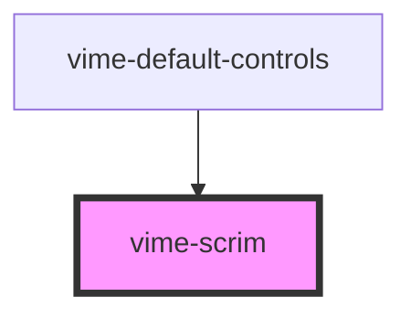

# vime-scrim

A darkened overlay or gradient that covers the current video to enable controls placed on it to be
more visible.

## Example

```html {4}
<vime-player>
  <!-- ... -->
  <vime-ui>
    <vime-scrim></vime-scrim>
  </vime-ui>
</vime-player>
```

<!-- Auto Generated Below -->

## Properties

| Property   | Attribute  | Description                                                                                                                                                                                                                                                                                                                                                                                                                                                        | Type                          | Default     |
| ---------- | ---------- | ------------------------------------------------------------------------------------------------------------------------------------------------------------------------------------------------------------------------------------------------------------------------------------------------------------------------------------------------------------------------------------------------------------------------------------------------------------------ | ----------------------------- | ----------- |
| `gradient` | `gradient` | If this prop is defined, a dark gradient that smoothly fades out without being noticed will be used instead of a set color. This prop also sets the direction in which the dark end of the gradient should start. If the direction is set to `up`, the dark end of the gradient will start at the bottom of the player and fade out to the center. If the direction is set to `down`, the gradient will start at the top of the player and fade out to the center. | `"down" \| "up" \| undefined` | `undefined` |

## CSS Custom Properties

| Name         | Description                        |
| ------------ | ---------------------------------- |
| `--scrim-bg` | The background color of the scrim. |

## Dependencies

### Used by

- [vime-default-controls](../controls/default-controls)

### Graph



---

_Built with [StencilJS](https://stenciljs.com/)_
