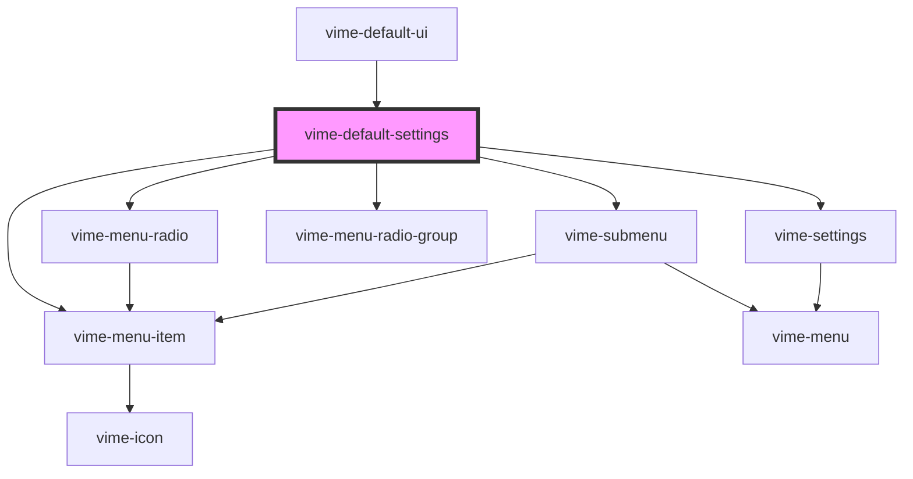

# vime-default-settings

Creates a settings menu with options for changing the playback rate, quality and captions of
the current media. This component is provider aware. For example, it will only show options for
changing the playback rate if the current provider allows changing it (`player.canSetPlaybackRate()`).

## Example

```html {5}
<vime-player>
  <!-- ... -->
  <vime-ui>
    <!-- ... -->
    <vime-default-settings></vime-default-settings>
  </vime-ui>
</vime-player>
```

<!-- Auto Generated Below -->

## Slots

| Slot | Description                                                                                        |
| ---- | -------------------------------------------------------------------------------------------------- |
|      | Used to extend the settings with additional menu options (see `vime-submenu` or `vime-menu-item`). |

## Dependencies

### Used by

- [vime-default-ui](../../default-ui)

### Depends on

- [vime-menu-item](../menu-item)
- [vime-menu-radio](../menu-radio)
- [vime-submenu](../submenu)
- [vime-menu-radio-group](../menu-radio-group)
- [vime-settings](../settings)

### Graph



---

_Built with [StencilJS](https://stenciljs.com/)_
