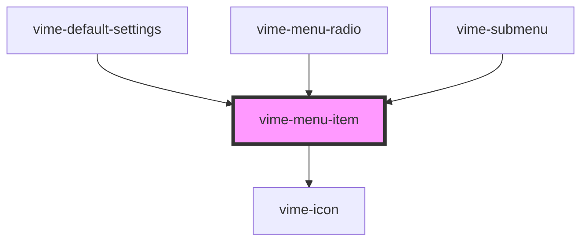

# vime-menu-item

A multi-purpose interactable element inside a menu. The behaviour and style of the item depends on
the props set.

- **Default:** By default, the menu item only contains a label and optional hint/badge text that is
  displayed on the right-hand side of the item.
- **Navigation:** If the `menu` prop is set, the item behaves as a navigational control and displays
  arrows to indicate whether clicking the control will navigate forwards/backwards.
- **Radio:** If the `checked` prop is set, the item behaves as a radio button and displays a
  checkmark icon to indicate whether it is checked or not.

## Visual


<!-- Auto Generated Below -->

## Usage

### Angular

```html {6} title="example.html"
<vime-player>
  <!-- ... -->
  <vime-ui>
    <!-- ... -->
    <vime-settings>
      <vime-menu-item label="Playback Quality" hint="Auto"></vime-menu-item>
    </vime-settings>
  </vime-ui>
</vime-player>
```

### Html

```html {6}
<vime-player>
  <!-- ... -->
  <vime-ui>
    <!-- ... -->
    <vime-settings>
      <vime-menu-item label="Playback Quality" hint="Auto"></vime-menu-item>
    </vime-settings>
  </vime-ui>
</vime-player>
```

### React

```tsx {2,11}
import React from 'react';
import { VimePlayer, VimeUi, VimeSettings, VimeMenuItem } from '@vime/react';

function Example() {
  return render(
    <VimePlayer>
      {/* ... */}
      <VimeUi>
        {/* ... */}
        <VimeSettings>
          <VimeMenuItem label="Playback Quality" hint="Auto" />
        </VimeSettings>
      </VimeUi>
    </VimePlayer>
  );
}
```

### Vue

```html {7,14,21} title="example.vue"
<template>
  <VimePlayer>
    <!-- ... -->
    <VimeUi>
      <!-- ... -->
      <VimeSettings>
        <VimeMenuItem label="Playback Quality" hint="Auto" />
      </VimeSettings>
    </VimeUi>
  </VimePlayer>
</template>

<script>
  import { VimePlayer, VimeUi, VimeSettings, VimeMenuItem } from '@vime/vue';

  export default {
    components: {
      VimePlayer,
      VimeUi,
      VimeSettings,
      VimeMenuItem,
    },
  };
</script>
```

## Properties

| Property             | Attribute      | Description                                                                                                                                                                                               | Type                   | Default             |
| -------------------- | -------------- | --------------------------------------------------------------------------------------------------------------------------------------------------------------------------------------------------------- | ---------------------- | ------------------- |
| `badge`              | `badge`        | This can provide additional context about the value of a menu item. For example, if the item is a radio button for a set of video qualities, the badge could describe whether the quality is UHD, HD etc. | `string \| undefined`  | `undefined`         |
| `checked`            | `checked`      | If this item is to behave as a radio button, then this property determines whether the radio is selected or not. Sets the `aria-checked` property.                                                        | `boolean \| undefined` | `undefined`         |
| `checkedIcon`        | `checked-icon` | The URL to an SVG element or fragment to load.                                                                                                                                                            | `string \| undefined`  | `'#vime-checkmark'` |
| `expanded`           | `expanded`     | If the item has a popup menu, this indicates whether the menu is open or not. Sets the `aria-expanded` property.                                                                                          | `boolean \| undefined` | `undefined`         |
| `hidden`             | `hidden`       | Whether the item is displayed or not.                                                                                                                                                                     | `boolean`              | `false`             |
| `hint`               | `hint`         | This can provide additional context about some underlying state of the item. For example, if the menu item opens/closes a submenu with options, the hint could be the currently selected option.          | `string \| undefined`  | `undefined`         |
| `identifier`         | `identifier`   | The `id` attribute of the item.                                                                                                                                                                           | `string \| undefined`  | `undefined`         |
| `label` _(required)_ | `label`        | The label/title of the item.                                                                                                                                                                              | `string`               | `undefined`         |
| `menu`               | `menu`         | If the item has a popup menu, then this should be the `id` of said menu. Sets the `aria-controls` property.                                                                                               | `string \| undefined`  | `undefined`         |

## CSS Custom Properties

| Name                            | Description                                                                  |
| ------------------------------- | ---------------------------------------------------------------------------- |
| `--menu-item-arrow-color`       | The color of the left/right arrow on a navigational menu item.               |
| `--menu-item-badge-bg`          | The background color of the badge.                                           |
| `--menu-item-badge-color`       | The color of the badge text.                                                 |
| `--menu-item-badge-font-size`   | The font size of the the badge text.                                         |
| `--menu-item-check-icon-height` | The height of the checked icon.                                              |
| `--menu-item-check-icon-width`  | The width of the checked icon.                                               |
| `--menu-item-divider-color`     | The color of the divider between a navigational menu item and the menu body. |
| `--menu-item-focus-bg`          | The background color of a menu item when it is being focused or hovered on.  |
| `--menu-item-focus-color`       | The color of a menu item's text when it is being focused or hovered on.      |
| `--menu-item-hint-color`        | The color of the hint text.                                                  |
| `--menu-item-hint-font-size`    | The font size of the hint text.                                              |
| `--menu-item-hint-opacity`      | The opacity of the hint text.                                                |
| `--menu-item-padding`           | The padding within each menu item.                                           |
| `--menu-item-tap-highlight`     | The highlight color when a menu item is tapped.                              |

## Dependencies

### Used by

- [vime-default-settings](../default-settings)
- [vime-menu-radio](../menu-radio)
- [vime-submenu](../submenu)

### Depends on

- [vime-icon](../../icon)

### Graph



---

_Built with [StencilJS](https://stenciljs.com/)_
