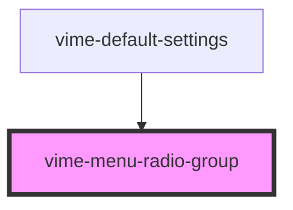

# vime-menu-radio-group

A collection of radio buttons describing a set of related options. Only one radio button in a group
can be selected at the same time.

## Visual


<!-- Auto Generated Below -->


## Usage

### Angular

```html {7-11} title="example.html"
<vime-player>
  <!-- ... -->
  <vime-ui>
    <!-- ... -->
    <vime-settings>
      <vime-submenu label="Playback Rate">
        <vime-menu-radio-group [value]="value" (vCheck)="onValueChange($event)">
          <vime-menu-radio label="0.5" value="0.5" />
          <vime-menu-radio label="Normal" value="1" />
          <vime-menu-radio label="2" value="2" />
        </vime-menu-radio-group>
      </vime-submenu>
    </vime-settings>
  </vime-ui>
</vime-player>
```

```ts title="example.ts"
import { VimeMenuRadio } from '@vime/angular';

class Example {
  value = '1';

  onValueChange(event: Event) {
    const radio = event.target as VimeMenuRadio;
    this.value = radio.value;
  }
}
```


### Html

```html {7-11}
<vime-player>
  <!-- ... -->
  <vime-ui>
    <!-- ... -->
    <vime-settings>
      <vime-submenu label="Playback Rate">
        <vime-menu-radio-group value="1">
          <vime-menu-radio label="0.5" value="0.5" />
          <vime-menu-radio label="Normal" value="1" />
          <vime-menu-radio label="2" value="2" />
        </vime-menu-radio-group>
      </vime-submenu>
    </vime-settings>
  </vime-ui>
</vime-player>
```


### React

```tsx {7,26-30}
import React, { useState } from 'react';
import {
  VimePlayer,
  VimeUi,
  VimeSettings,
  VimeSubmenu,
  VimeMenuRadioGroup,
  VimeMenuRadio,
} from '@vime/react';

function Example() {
  const [value, setValue] = useState('1');

  const onValueChange = (event: Event) => {
    const radio = event.target as HTMLVimeMenuRadioElement;
    setValue(radio.value);
  };

  return (
    <VimePlayer>
      {/* ... */}
      <VimeUi>
        {/* ... */}
        <VimeSettings>
          <VimeSubmenu label="Playback Rate">
            <VimeMenuRadioGroup value={value} onVCheck={onValueChange}>
              <VimeMenuRadio label="0.5" value="0.5" />
              <VimeMenuRadio label="Normal" value="1" />
              <VimeMenuRadio label="2" value="2" />
            </VimeMenuRadioGroup>
          </VimeSubmenu>
        </VimeSettings>
      </VimeUi>
    </VimePlayer>
  );
}
```


### Svelte

```tsx {7-11}
<VimePlayer>
  <!-- ... -->
  <VimeUi>
    <!-- ... -->
    <VimeSettings>
      <VimeSubmenu label="Playback Rate">
        <VimeMenuRadioGroup value={value} on:vCheck={onValueChange}>
          <VimeMenuRadio label="0.5" value="0.5" />
          <VimeMenuRadio label="Normal" value="1" />
          <VimeMenuRadio label="2" value="2" />
        </VimeMenuRadioGroup>
      </VimeSubmenu>
    </VimeSettings>
  </VimeUi>
</VimePlayer>
```

```html {7}
<script lang="ts">
  import {
    VimePlayer,
    VimeUi,
    VimeSettings,
    VimeSubmenu,
    VimeMenuRadioGroup,
    VimeMenuRadio,
  } from '@vime/svelte';

  let value = '1';

  const onValueChange = (event: Event) => {
    const radio = event.target as HTMLVimeMenuRadioElement;
    value = radio.value;
  };
</script>
```


### Vue

```html {8-12,25,35} title="example.vue"
<template>
  <VimePlayer>
    <!-- ... -->
    <VimeUi>
      <!-- ... -->
      <VimeSettings>
        <VimeSubmenu label="Playback Rate">
          <VimeMenuRadioGroup :value="value" @vCheck="onValueChange($event)">
            <VimeMenuRadio label="0.5" value="0.5" />
            <VimeMenuRadio label="Normal" value="1" />
            <VimeMenuRadio label="2" value="2" />
          </VimeMenuRadioGroup>
        </VimeSubmenu>
      </VimeSettings>
    </VimeUi>
  </VimePlayer>
</template>

<script>
  import {
    VimePlayer,
    VimeUi,
    VimeSettings,
    VimeSubmenu,
    VimeMenuRadioGroup,
    VimeMenuRadio,
  } from "@vime/vue";

  export default {
    components: {
      VimePlayer,
      VimeUi,
      VimeSettings,
      VimeSubmenu,
      VimeMenuRadioGroup,
      VimeMenuRadio,
    },
    data: {
      value: 1,
    },
    methods: {
      onValueChange(event) {
        const radio = event.target as HTMLVimeMenuRadioElement;
        this.value = radio.value;
      },
    },
  };
</script>
```


## Properties

| Property | Attribute | Description                                | Type                  | Default     |
| -------- | --------- | ------------------------------------------ | --------------------- | ----------- |
| `value`  | `value`   | The current value selected for this group. | `string \| undefined` | `undefined` |


## Events

| Event    | Description                                                 | Type                |
| -------- | ----------------------------------------------------------- | ------------------- |
| `vCheck` | Emitted when a new radio button is selected for this group. | `CustomEvent<void>` |


## Slots

| Slot | Description                                        |
| ---- | -------------------------------------------------- |
|      | Used to pass in radio buttons (`vime-menu-radio`). |


## Dependencies

### Used by

 - [vime-default-settings](../default-settings)

### Graph


----------------------------------------------

*Built with [StencilJS](https://stenciljs.com/)*
