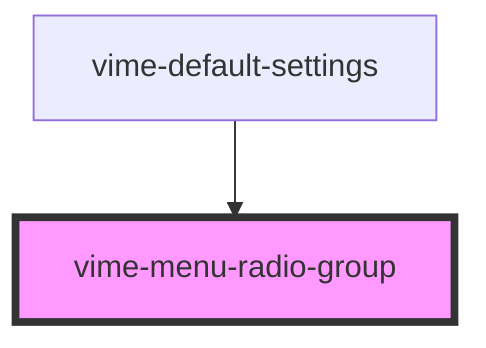

# vime-menu-radio-group

A collection of radio buttons describing a set of related options. Only one radio button in a group 
can be selected at the same time.

## Example

```html
<vime-player>
  <!-- ... -->
  <vime-ui>
    <!-- ... -->
    <vime-settings>
      <vime-submenu label="Playback Rate">
        <vime-menu-radio-group value="1">
          <vime-menu-radio label="0.5" value ="0.5" />
          <vime-menu-radio label="Normal" value ="1" />
          <vime-menu-radio label="2" value ="2" />
        </vime-menu-radio-group>
      </vime-submenu>
    </vime-settings>
  </vime-ui>
</vime-player>
```

<!-- Auto Generated Below -->


## Properties

| Property | Attribute | Description                                | Type                  | Default     |
| -------- | --------- | ------------------------------------------ | --------------------- | ----------- |
| `value`  | `value`   | The current value selected for this group. | `string \| undefined` | `undefined` |


## Events

| Event   | Description                                                 | Type                |
| ------- | ----------------------------------------------------------- | ------------------- |
| `check` | Emitted when a new radio button is selected for this group. | `CustomEvent<void>` |


## Slots

| Slot | Description                                        |
| ---- | -------------------------------------------------- |
|      | Used to pass in radio buttons (`vime-menu-radio`). |


## Dependencies

### Used by

 - [vime-default-settings](../default-settings)

### Graph


----------------------------------------------

*Built with [StencilJS](https://stenciljs.com/)*
