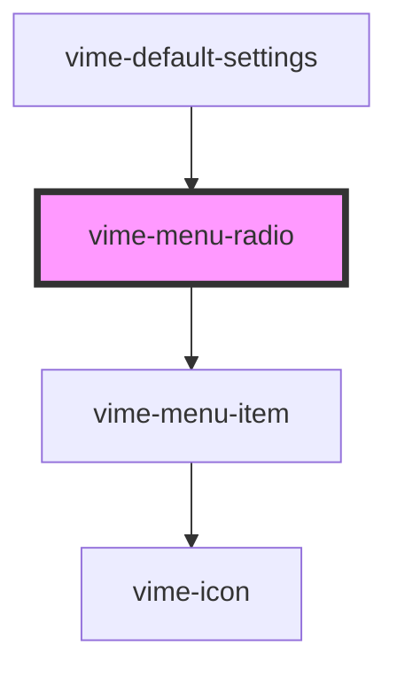

# vime-menu-radio

Menu radio buttons are presented in radio groups (a collection of radio buttons describing a set
of related options). Only one radio button in a group can be selected at the same time.

## Visual


<!-- Auto Generated Below -->


## Usage

### Angular

```html {8-10} title="example.html"
<vime-player>
  <!-- ... -->
  <vime-ui>
    <!-- ... -->
    <vime-settings>
      <vime-submenu label="Playback Rate">
        <vime-menu-radio-group value="1">
          <vime-menu-radio label="0.5" value="0.5" />
          <vime-menu-radio label="Normal" value="1" />
          <vime-menu-radio label="2" value="2" />
        </vime-menu-radio-group>
      </vime-submenu>
    </vime-settings>
  </vime-ui>
</vime-player>
```


### Html

```html {8-10}
<vime-player>
  <!-- ... -->
  <vime-ui>
    <!-- ... -->
    <vime-settings>
      <vime-submenu label="Playback Rate">
        <vime-menu-radio-group value="1">
          <vime-menu-radio label="0.5" value="0.5" />
          <vime-menu-radio label="Normal" value="1" />
          <vime-menu-radio label="2" value="2" />
        </vime-menu-radio-group>
      </vime-submenu>
    </vime-settings>
  </vime-ui>
</vime-player>
```


### React

```tsx {8,20-22}
import React from 'react';
import {
  VimePlayer,
  VimeUi,
  VimeSettings,
  VimeSubmenu,
  VimeMenuRadioGroup,
  VimeMenuRadio,
} from '@vime/react';

function Example() {
  return (
    <VimePlayer>
      {/* ... */}
      <VimeUi>
        {/* ... */}
        <VimeSettings>
          <VimeSubmenu label="Playback Rate">
            <VimeMenuRadioGroup value="1">
              <VimeMenuRadio label="0.5" value="0.5" />
              <VimeMenuRadio label="Normal" value="1" />
              <VimeMenuRadio label="2" value="2" />
            </VimeMenuRadioGroup>
          </VimeSubmenu>
        </VimeSettings>
      </VimeUi>
    </VimePlayer>
  );
}
```


### Stencil

```tsx {11-13}
class Example {
  render() {
    return (
      <vime-player>
        {/* ... */}
        <vime-ui>
          {/* ... */}
          <vime-settings>
            <vime-submenu label="Playback Rate">
              <vime-menu-radio-group value="1">
                <vime-menu-radio label="0.5" value="0.5" />
                <vime-menu-radio label="Normal" value="1" />
                <vime-menu-radio label="2" value="2" />
              </vime-menu-radio-group>
            </vime-submenu>
          </vime-settings>
        </vime-ui>
      </vime-player>
    );
  }
}
```


### Svelte

```html {8-10,24} title="example.svelte"
<VimePlayer>
  <!-- ... -->
  <VimeUi>
    <!-- ... -->
    <VimeSettings>
      <VimeSubmenu label="Playback Rate">
        <VimeMenuRadioGroup value="1">
          <VimeMenuRadio label="0.5" value="0.5" />
          <VimeMenuRadio label="Normal" value="1" />
          <VimeMenuRadio label="2" value="2" />
        </VimeMenuRadioGroup>
      </VimeSubmenu>
    </VimeSettings>
  </VimeUi>
</VimePlayer>

<script lang="ts">
  import {
    VimePlayer,
    VimeUi,
    VimeSettings,
    VimeSubmenu,
    VimeMenuRadioGroup,
    VimeMenuRadio,
  } from '@vime/svelte';
</script>
```


### Vue

```html {9-11,26,36} title="example.vue"
<template>
  <VimePlayer>
    <!-- ... -->
    <VimeUi>
      <!-- ... -->
      <VimeSettings>
        <VimeSubmenu label="Playback Rate">
          <VimeMenuRadioGroup value="1">
            <VimeMenuRadio label="0.5" value="0.5" />
            <VimeMenuRadio label="Normal" value="1" />
            <VimeMenuRadio label="2" value="2" />
          </VimeMenuRadioGroup>
        </VimeSubmenu>
      </VimeSettings>
    </VimeUi>
  </VimePlayer>
</template>

<script>
  import {
    VimePlayer,
    VimeUi,
    VimeSettings,
    VimeSubmenu,
    VimeMenuRadioGroup,
    VimeMenuRadio,
  } from '@vime/vue';

  export default {
    components: {
      VimePlayer,
      VimeUi,
      VimeSettings,
      VimeSubmenu,
      VimeMenuRadioGroup,
      VimeMenuRadio,
    },
  };
</script>
```


## Properties

| Property             | Attribute      | Description                                                                                                                                                                   | Type                  | Default             |
| -------------------- | -------------- | ----------------------------------------------------------------------------------------------------------------------------------------------------------------------------- | --------------------- | ------------------- |
| `badge`              | `badge`        | This can provide additional context about the value. For example, if the option is for a set of video qualities, the badge could describe whether the quality is UHD, HD etc. | `string \| undefined` | `undefined`         |
| `checked`            | `checked`      | Whether the radio item is selected or not.                                                                                                                                    | `boolean`             | `false`             |
| `checkedIcon`        | `checked-icon` | The URL to an SVG element or fragment to load.                                                                                                                                | `string \| undefined` | `'#vime-checkmark'` |
| `label` _(required)_ | `label`        | The title of the radio item displayed to the user.                                                                                                                            | `string`              | `undefined`         |
| `value` _(required)_ | `value`        | The value associated with this radio item.                                                                                                                                    | `string`              | `undefined`         |


## Events

| Event    | Description                                | Type                |
| -------- | ------------------------------------------ | ------------------- |
| `vCheck` | Emitted when the radio button is selected. | `CustomEvent<void>` |


## Dependencies

### Used by

 - [vime-default-settings](../default-settings)

### Depends on

- [vime-menu-item](../menu-item)

### Graph


----------------------------------------------

*Built with [StencilJS](https://stenciljs.com/)*
