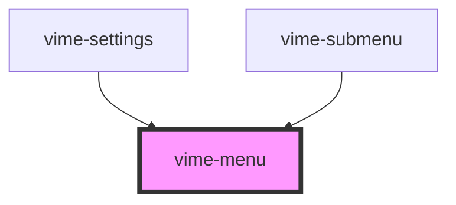

# vime-menu

This component is responsible for containing and managing menu items and submenus. The menu is ARIA 
friendly by ensuring the correct ARIA properties are set, and enabling keyboard navigation when it 
is focused.

It is rare that you will interact with this component directly, see the `vime-settings` and 
`vime-submenu` components for building out a complete settings menu.

## Example

```html
<vime-menu
  identifer="menu"
  controller="menu-controller"
  active
>
  <!-- ... -->
</vime-menu>
```

<!-- Auto Generated Below -->


## Properties

| Property                  | Attribute    | Description                                                                        | Type      | Default     |
| ------------------------- | ------------ | ---------------------------------------------------------------------------------- | --------- | ----------- |
| `active`                  | `active`     | Whether the menu is open/visible.                                                  | `boolean` | `false`     |
| `controller` _(required)_ | `controller` | The `id` attribute value of the control responsible for opening/closing this menu. | `string`  | `undefined` |
| `identifier` _(required)_ | `identifier` | The `id` attribute of the menu.                                                    | `string`  | `undefined` |


## Events

| Event             | Description                                           | Type                                                            |
| ----------------- | ----------------------------------------------------- | --------------------------------------------------------------- |
| `close`           | Emitted when the menu has closed/is not active.       | `CustomEvent<void>`                                             |
| `focusedMenuItem` | Emitted when the currently focused menu item changes. | `CustomEvent<HTMLVimeMenuItemElement \| undefined>`             |
| `menuItemsChange` | Emitted when the menu items present changes.          | `CustomEvent<NodeListOf<HTMLVimeMenuItemElement> \| undefined>` |
| `open`            | Emitted when the menu is open/active.                 | `CustomEvent<void>`                                             |


## Methods

### `focusOnOpen() => Promise<void>`

This should be called directly before opening the menu to set the keyboard focus on it. This
is a one-time operation and needs to be called everytime prior to opening the menu.

#### Returns

Type: `Promise<void>`


### `getController() => Promise<HTMLElement>`

Returns the controller responsible for opening/closing this menu.

#### Returns

Type: `Promise<HTMLElement>`


### `getFocusedMenuItem() => Promise<HTMLVimeMenuItemElement>`

Returns the currently focused menu item.

#### Returns

Type: `Promise<HTMLVimeMenuItemElement>`


## Slots

| Slot | Description                                                                                           |
| ---- | ----------------------------------------------------------------------------------------------------- |
|      | Used to pass in the body of the menu which usually contains menu items, radio groups and/or submenus. |


## CSS Custom Properties

| Name                 | Description                              |
| -------------------- | ---------------------------------------- |
| `--menu-bg`          | The background color the menu.           |
| `--menu-color`       | The text color within the menu.          |
| `--menu-font-size`   | The font size of text within the menu.   |
| `--menu-font-weight` | The font weight of text within the menu. |


## Dependencies

### Used by

 - [vime-settings](../settings)
 - [vime-submenu](../submenu)

### Graph


----------------------------------------------

*Built with [StencilJS](https://stenciljs.com/)*
