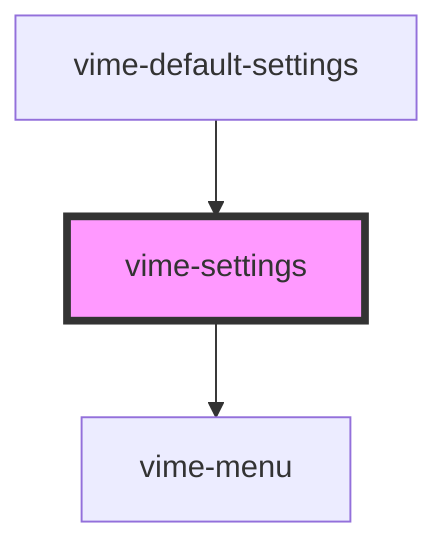

# vime-settings

A container for a collection of submenus and options for the player. On desktop, the settings is
displayed as a small popup menu (scroll appears if `height >= maxHeight`) on the bottom right-hand
side of a video player, or slightly above the right-hand side of an audio player. On mobile,
the settings is displayed as a [bottom sheet](https://material.io/components/sheets-bottom).

## Visual


<!-- Auto Generated Below -->


## Usage

### Angular

```html {5-7} title="example.html"
<vime-player>
  <!-- ... -->
  <vime-ui>
    <!-- ... -->
    <vime-settings>
      <!-- ... -->
    </vime-settings>
  </vime-ui>
</vime-player>
```


### Html

```html {5-7}
<vime-player>
  <!-- ... -->
  <vime-ui>
    <!-- ... -->
    <vime-settings>
      <!-- ... -->
    </vime-settings>
  </vime-ui>
</vime-player>
```


### React

```tsx {2,10}
import React from 'react';
import { VimePlayer, VimeUi, VimeSettings } from '@vime/react';

function Example() {
  return (
    <VimePlayer>
      {/* ... */}
      <VimeUi>
        {/* ... */}
        <VimeSettings>{/* ... */}</VimeSettings>
      </VimeUi>
    </VimePlayer>
  );
}
```


### Svelte

```html {5-7,12} title="example.svelte"
<VimePlayer>
  <!-- ... -->
  <VimeUi>
    <!-- ... -->
    <VimeSettings>
      <!-- ... -->
    </VimeSettings>
  </VimeUi>
</VimePlayer>

<script lang="ts">
  import { VimePlayer, VimeUi, VimeSettings } from '@vime/svelte';
</script>
```


### Vue

```html {6-8,14,20} title="example.vue"
<template>
  <VimePlayer>
    <!-- ... -->
    <VimeUi>
      <!-- ... -->
      <VimeSettings>
        <!-- ... -->
      </VimeSettings>
    </VimeUi>
  </VimePlayer>
</template>

<script>
  import { VimePlayer, VimeUi, VimeSettings } from '@vime/vue';

  export default {
    components: {
      VimePlayer,
      VimeUi,
      VimeSettings,
    },
  };
</script>
```


## Properties

| Property         | Attribute         | Description                                                                                                                                                                                | Type                                                       | Default         |
| ---------------- | ----------------- | ------------------------------------------------------------------------------------------------------------------------------------------------------------------------------------------ | ---------------------------------------------------------- | --------------- |
| `active`         | `active`          | Whether the settings menu is opened/closed.                                                                                                                                                | `boolean`                                                  | `false`         |
| `controlsHeight` | `controls-height` | The height of any lower control bar in pixels so that the settings can re-position itself accordingly.                                                                                     | `number`                                                   | `0`             |
| `pin`            | `pin`             | Pins the settings to the defined position inside the video player. This has no effect when the view is of type `audio` (always `bottomRight`) and on mobile devices (always bottom sheet). | `"bottomLeft" \| "bottomRight" \| "topLeft" \| "topRight"` | `'bottomRight'` |


## Methods

### `setController(id: string, controller: SettingsController) => Promise<void>`

Sets the controller responsible for opening/closing this settings.

#### Returns

Type: `Promise<void>`


## Slots

| Slot | Description                                                                     |
| ---- | ------------------------------------------------------------------------------- |
|      | Used to pass in the body of the settings menu, which usually contains submenus. |


## CSS Custom Properties

| Name                            | Description                                     |
| ------------------------------- | ----------------------------------------------- |
| `--settings-border-radius`      | The border radius of the settings menu.         |
| `--settings-max-height`         | The max height of the settings menu.            |
| `--settings-padding`            | The padding inside the settings menu.           |
| `--settings-scroll-thumb-color` | The color of the settings scrollbar thumb.      |
| `--settings-scroll-track-color` | The color of the settings scrollbar track.      |
| `--settings-scroll-width`       | The width of the settings scrollbar.            |
| `--settings-shadow`             | The shadow cast around the settings menu frame. |
| `--settings-width`              | The width of the settings menu.                 |


## Dependencies

### Used by

 - [vime-default-settings](../default-settings)

### Depends on

- [vime-menu](../menu)

### Graph


----------------------------------------------

*Built with [StencilJS](https://stenciljs.com/)*
