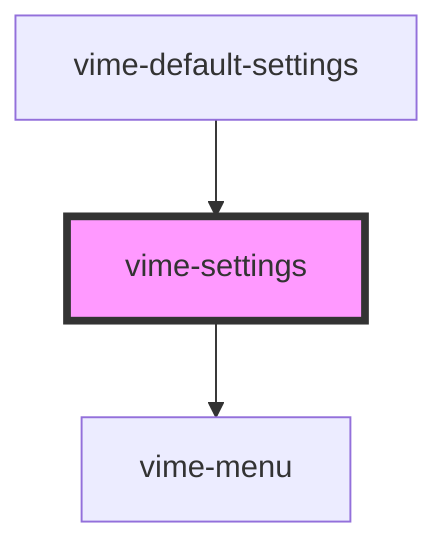

# vime-settings

A container for a collection of submenus and options for the player. On desktop, the settings is 
displayed as a small popup menu (scroll appears if `height >= maxHeight`) on the bottom right-hand
side of a video player, or slightly above the right-hand side of an audio player. On mobile, 
the settings is displayed as a [bottom sheet](https://material.io/components/sheets-bottom).

## Example

```htm
<vime-player>
  <!-- ... -->
  <vime-ui>
    <!-- ... -->
    <vime-settings>
      <vime-submenu label="Playback Rate" hint="Normal">
        <vime-menu-radio-group value="1">
          <vime-menu-radio label="0.5" value ="0.5" />
          <vime-menu-radio label="Normal" value ="1" />
          <vime-menu-radio label="2" value ="2" />
        </vime-menu-radio-group>
      </vime-submenu>

      <vime-submenu label="Playback Quality" hint="720p">
        <vime-menu-radio-group value="720p">
          <vime-menu-radio label="1080p" value ="1080p" />
          <vime-menu-radio label="720p" value ="720p" />
          <vime-menu-radio label="480p" value ="480p" />
        </vime-menu-radio-group>
      </vime-submenu>
    </vime-settings>
  </vime-ui>
</vime-player>
```

<!-- Auto Generated Below -->


## Properties

| Property         | Attribute         | Description                                                                                            | Type      | Default |
| ---------------- | ----------------- | ------------------------------------------------------------------------------------------------------ | --------- | ------- |
| `active`         | `active`          | Whether the settings menu is opened/closed.                                                            | `boolean` | `false` |
| `controlsHeight` | `controls-height` | The height of any lower control bar in pixels so that the settings can re-position itself accordingly. | `number`  | `65`    |


## Methods

### `setController(id: string, controller: SettingsController) => Promise<void>`

Sets the controller responsible for opening/closing this settings.

#### Returns

Type: `Promise<void>`


## Slots

| Slot | Description                                                                     |
| ---- | ------------------------------------------------------------------------------- |
|      | Used to pass in the body of the settings menu, which usually contains submenus. |


## CSS Custom Properties

| Name                            | Description                                                  |
| ------------------------------- | ------------------------------------------------------------ |
| `--settings-audio-max-height`   | The max height of the settings when outside an audio player. |
| `--settings-border-radius`      | The border radius of the settings menu.                      |
| `--settings-max-height`         | The max height of the settings menu.                         |
| `--settings-padding`            | The padding inside the settings menu.                        |
| `--settings-scroll-thumb-color` | The color of the settings scrollbar thumb.                   |
| `--settings-scroll-track-color` | The color of the settings scrollbar track.                   |
| `--settings-scroll-width`       | The width of the settings scrollbar.                         |
| `--settings-shadow`             | The shadow cast around the settings menu frame.              |
| `--settings-width`              | The width of the settings menu.                              |


## Dependencies

### Used by

 - [vime-default-settings](../default-settings)

### Depends on

- [vime-menu](../menu)

### Graph


----------------------------------------------

*Built with [StencilJS](https://stenciljs.com/)*
