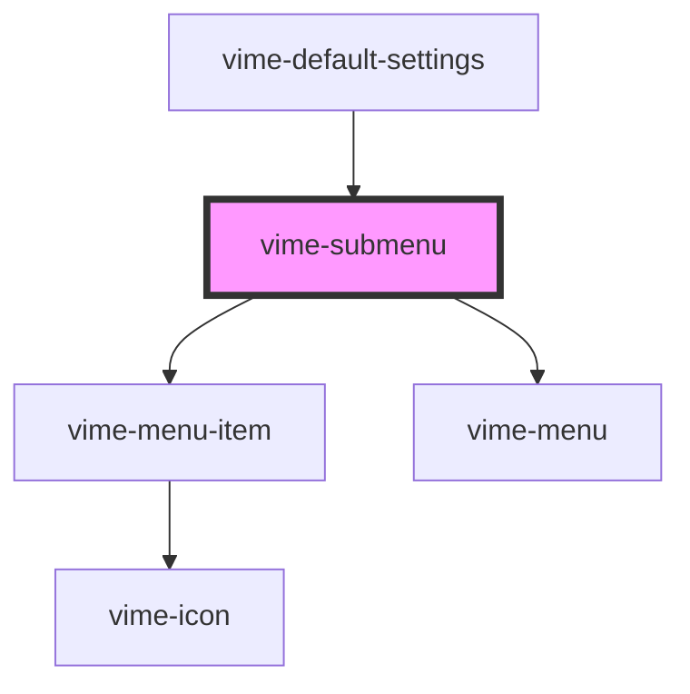

# vime-submenu

A menu that is to be nested inside another menu. A submenu is closed by default and it provides a
menu item that will open/close it. It's main purpose is to organize a menu by grouping related
sections/options together that can be navigated to by the user.

## Example

```html {6-12,14-20}
<vime-player>
  <!-- ... -->
  <vime-ui>
    <!-- ... -->
    <vime-settings>
      <vime-submenu label="Playback Rate" hint="Normal">
        <vime-menu-radio-group value="1">
          <vime-menu-radio label="0.5" value="0.5" />
          <vime-menu-radio label="Normal" value="1" />
          <vime-menu-radio label="2" value="2" />
        </vime-menu-radio-group>
      </vime-submenu>

      <vime-submenu label="Playback Quality" hint="720p">
        <vime-menu-radio-group value="720p">
          <vime-menu-radio label="1080p" value="1080p" />
          <vime-menu-radio label="720p" value="720p" />
          <vime-menu-radio label="480p" value="480p" />
        </vime-menu-radio-group>
      </vime-submenu>
    </vime-settings>
  </vime-ui>
</vime-player>
```

<!-- Auto Generated Below -->

## Properties

| Property             | Attribute | Description                                                                                                                                                                     | Type                  | Default     |
| -------------------- | --------- | ------------------------------------------------------------------------------------------------------------------------------------------------------------------------------- | --------------------- | ----------- |
| `active`             | `active`  | Whether the submenu is open/closed.                                                                                                                                             | `boolean`             | `false`     |
| `hidden`             | `hidden`  | Whether the submenu should be displayed or not.                                                                                                                                 | `boolean`             | `false`     |
| `hint`               | `hint`    | This can provide additional context about the current state of the submenu. For example, the hint could be the currently selected option if the submenu contains a radio group. | `string \| undefined` | `undefined` |
| `label` _(required)_ | `label`   | The title of the submenu.                                                                                                                                                       | `string`              | `undefined` |

## Slots

| Slot | Description                                                                                                                       |
| ---- | --------------------------------------------------------------------------------------------------------------------------------- |
|      | Used to pass in the body of the submenu which is usually a set of choices in the form of a radio group (`vime-menu-radio-group`). |

## Dependencies

### Used by

- [vime-default-settings](../default-settings)

### Depends on

- [vime-menu-item](../menu-item)
- [vime-menu](../menu)

### Graph



---

_Built with [StencilJS](https://stenciljs.com/)_
