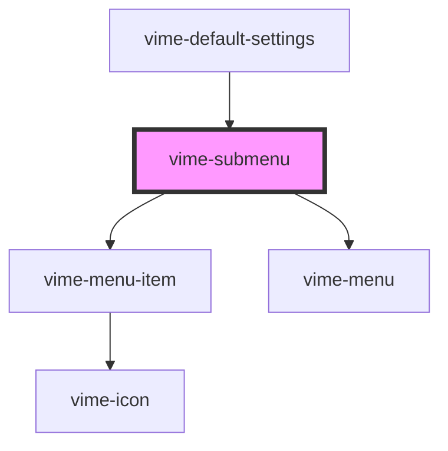

# vime-submenu

A menu that is to be nested inside another menu. A submenu is closed by default and it provides a
menu item that will open/close it. It's main purpose is to organize a menu by grouping related
sections/options together that can be navigated to by the user.

## Visual


<!-- Auto Generated Below -->

## Usage

### Angular

```html {6-8} title="example.html"
<vime-player>
  <!-- ... -->
  <vime-ui>
    <!-- ... -->
    <vime-settings>
      <vime-submenu label="Title">
        <!-- ... -->
      </vime-submenu>
    </vime-settings>
  </vime-ui>
</vime-player>
```

### Html

```html {6-8}
<vime-player>
  <!-- ... -->
  <vime-ui>
    <!-- ... -->
    <vime-settings>
      <vime-submenu label="Title">
        <!-- ... -->
      </vime-submenu>
    </vime-settings>
  </vime-ui>
</vime-player>
```

### React

```tsx {2,11}
import React from 'react';
import { VimePlayer, VimeUi, VimeSettings, VimeSubmenu } from '@vime/react';

function Example() {
  return render(
    <VimePlayer>
      {/* ... */}
      <VimeUi>
        {/* ... */}
        <VimeSettings>
          <VimeSubmenu label="Title">{/* ... */}</VimeSubmenu>
        </VimeSettings>
      </VimeUi>
    </VimePlayer>
  );
}
```

### Svelte

```html {6-8,18} title="example.svelte"
<VimePlayer>
  <!-- ... -->
  <VimeUi>
    <!-- ... -->
    <VimeSettings>
      <VimeSubmenu label="Title">
        <!-- ... -->
      </VimeSubmenu>
    </VimeSettings>
  </VimeUi>
</VimePlayer>

<script lang="ts">
  import { VimePlayer, VimeUi, VimeSettings, VimeSubmenu } from '@vime/svelte';
</script>
```

### Vue

```html {7-9,16,23} title="example.vue"
<template>
  <VimePlayer>
    <!-- ... -->
    <VimeUi>
      <!-- ... -->
      <VimeSettings>
        <VimeSubmenu label="Title">
          <!-- ... -->
        </VimeSubmenu>
      </VimeSettings>
    </VimeUi>
  </VimePlayer>
</template>

<script>
  import { VimePlayer, VimeUi, VimeSettings, VimeSubmenu } from '@vime/vue';

  export default {
    components: {
      VimePlayer,
      VimeUi,
      VimeSettings,
      VimeSubmenu,
    },
  };
</script>
```

## Properties

| Property             | Attribute | Description                                                                                                                                                                     | Type                  | Default     |
| -------------------- | --------- | ------------------------------------------------------------------------------------------------------------------------------------------------------------------------------- | --------------------- | ----------- |
| `active`             | `active`  | Whether the submenu is open/closed.                                                                                                                                             | `boolean`             | `false`     |
| `hidden`             | `hidden`  | Whether the submenu should be displayed or not.                                                                                                                                 | `boolean`             | `false`     |
| `hint`               | `hint`    | This can provide additional context about the current state of the submenu. For example, the hint could be the currently selected option if the submenu contains a radio group. | `string \| undefined` | `undefined` |
| `label` _(required)_ | `label`   | The title of the submenu.                                                                                                                                                       | `string`              | `undefined` |

## Slots

| Slot | Description                                                                                                                       |
| ---- | --------------------------------------------------------------------------------------------------------------------------------- |
|      | Used to pass in the body of the submenu which is usually a set of choices in the form of a radio group (`vime-menu-radio-group`). |

## Dependencies

### Used by

- [vime-default-settings](../default-settings)

### Depends on

- [vime-menu-item](../menu-item)
- [vime-menu](../menu)

### Graph



---

_Built with [StencilJS](https://stenciljs.com/)_
