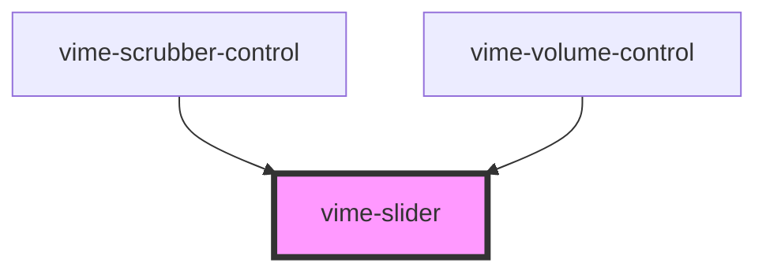

# vime-slider

A custom styled and ARIA friendly `input[type="range"]` component for inputting numeric values.
In addition, there are optimizations made for improved touch support (more information can be found
at https://github.com/sampotts/rangetouch).

## Example

```html
<vime-slider step="5" max="100" value="50" label="Volume" />
```

<!-- Auto Generated Below -->

## Properties

| Property    | Attribute    | Description                                                                                | Type                  | Default     |
| ----------- | ------------ | ------------------------------------------------------------------------------------------ | --------------------- | ----------- |
| `label`     | `label`      | A human-readable label for the purpose of the slider.                                      | `string \| undefined` | `undefined` |
| `max`       | `max`        | The greatest permitted value.                                                              | `number`              | `10`        |
| `min`       | `min`        | The lowest value in the range of permitted values.                                         | `number`              | `0`         |
| `step`      | `step`       | A number that specifies the granularity that the value must adhere to.                     | `number`              | `1`         |
| `value`     | `value`      | The current value.                                                                         | `number`              | `5`         |
| `valueText` | `value-text` | Human-readable text alternative for the current value. Defaults to `value:max` percentage. | `string \| undefined` | `undefined` |

## Events

| Event          | Description                                                     | Type                  |
| -------------- | --------------------------------------------------------------- | --------------------- |
| `vValueChange` | Emitted when the value of the underlying `input` field changes. | `CustomEvent<number>` |

## CSS Custom Properties

| Name                            | Description                                                       |
| ------------------------------- | ----------------------------------------------------------------- |
| `--slider-thumb-bg`             | The background color of the slider thumb.                         |
| `--slider-thumb-height`         | The height of the slider thumb.                                   |
| `--slider-thumb-shadow`         | The shadow cast around the slider thumb.                          |
| `--slider-thumb-width`          | The width of the slider thumb.                                    |
| `--slider-track-color`          | The color of the track.                                           |
| `--slider-track-focused-height` | The height of the track when it is focused.                       |
| `--slider-track-height`         | The height of the track.                                          |
| `--slider-value-color`          | The color of the part of the track filled upto the current value. |

## Dependencies

### Used by

- [vime-scrubber-control](../controls/scrubber-control)
- [vime-volume-control](../controls/volume-control)

### Graph



---

_Built with [StencilJS](https://stenciljs.com/)_
