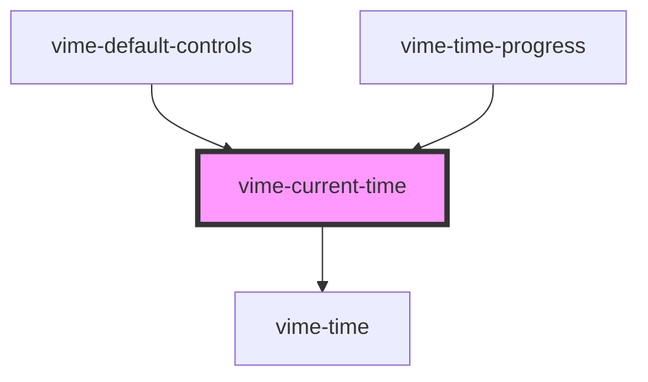

# vime-current-time

Formats and displays the current time of playback.

## Visual


<!-- Auto Generated Below -->


## Usage

### Angular

```html title="example.html"
<vime-current-time />
```


### Html

```html
<vime-current-time />
```


### React

```tsx {2,5}
import React from 'react';
import { VimeCurrentTime } from '@vime/react';

function Example() {
  return (<VimeCurrentTime />);
}
```


### Svelte

```html {1,4} title="example.svelte"
<VimeCurrentTime />

<script lang="ts">
  import { VimeCurrentTime } from '@vime/svelte';
</script>
```


### Vue

```html {2,6,10} title="example.vue"
<template>
  <VimeCurrentTime />
</template>

<script>
  import { VimeCurrentTime } from '@vime/vue';

  export default {
    components: {
      VimeCurrentTime,
    },
  };
</script>
```


## Properties

| Property          | Attribute           | Description                                                                                                           | Type      | Default |
| ----------------- | ------------------- | --------------------------------------------------------------------------------------------------------------------- | --------- | ------- |
| `alwaysShowHours` | `always-show-hours` | Whether the time should always show the hours unit, even if the time is less than 1 hour (eg: `20:35` -> `00:20:35`). | `boolean` | `false` |


## Dependencies

### Used by

 - [vime-default-controls](../../controls/default-controls)
 - [vime-time-progress](../time-progress)

### Depends on

- [vime-time](../time)

### Graph


----------------------------------------------

*Built with [StencilJS](https://stenciljs.com/)*
