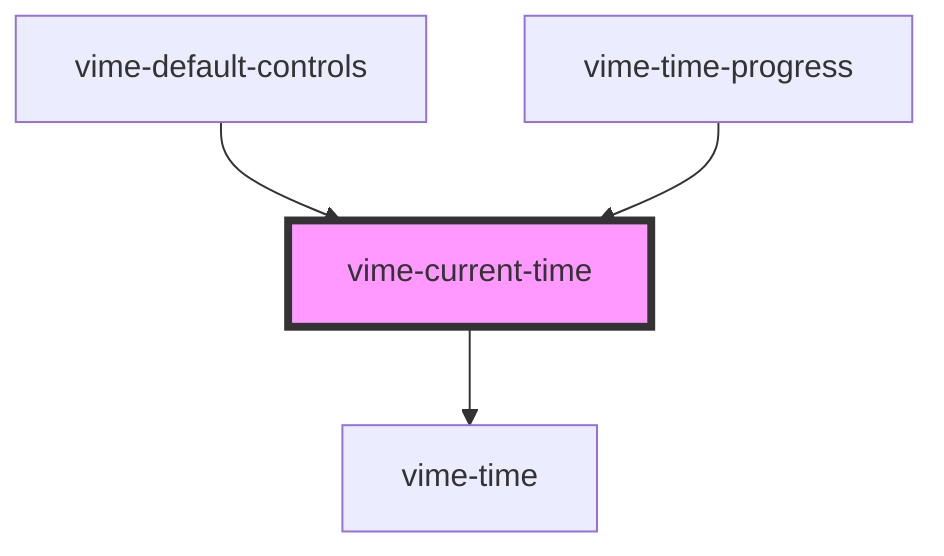

# vime-current-time

Formats and displays the current time of playback.

## Example

```html {5}
<vime-player>
  <!-- ... -->
  <vime-ui>
    <!-- ... -->
    <vime-current-time></vime-current-time>
  </vime-ui>
</vime-player>
```

<!-- Auto Generated Below -->

## Properties

| Property          | Attribute           | Description                                                                                                           | Type      | Default |
| ----------------- | ------------------- | --------------------------------------------------------------------------------------------------------------------- | --------- | ------- |
| `alwaysShowHours` | `always-show-hours` | Whether the time should always show the hours unit, even if the time is less than 1 hour (eg: `20:35` -> `00:20:35`). | `boolean` | `false` |

## Dependencies

### Used by

- [vime-default-controls](../../controls/default-controls)
- [vime-time-progress](../time-progress)

### Depends on

- [vime-time](../time)

### Graph



---

_Built with [StencilJS](https://stenciljs.com/)_
