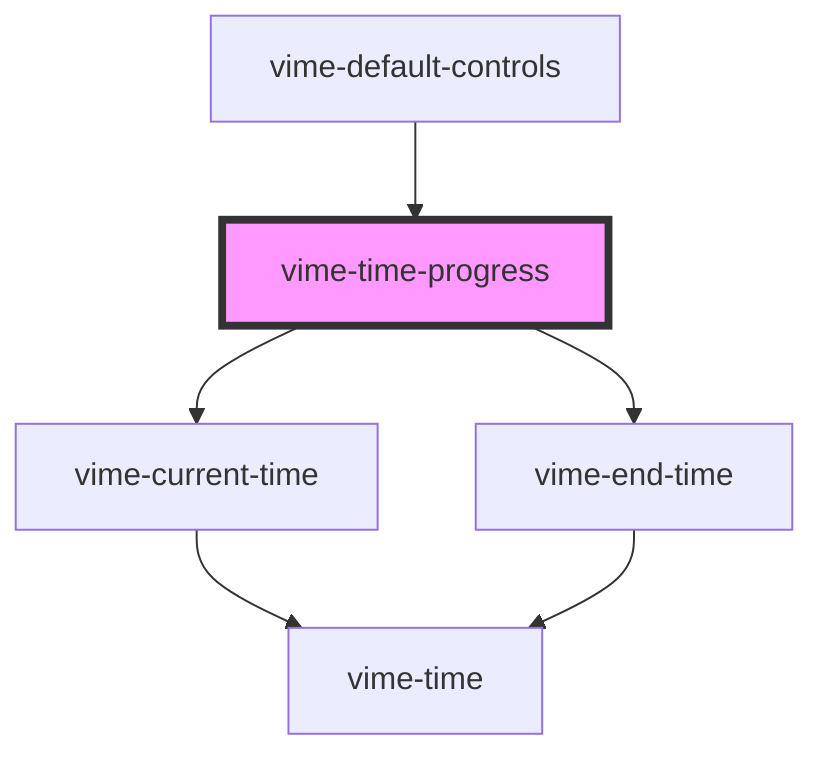

# vime-time-progress

Formats and displays the progression of playback as `currentTime (separator) endTime`.

## Example

```html {5}
<vime-player>
  <!-- ... -->
  <vime-ui>
    <!-- ... -->
    <vime-time-progress separator="/"></vime-time-progress>
  </vime-ui>
</vime-player>
```

<!-- Auto Generated Below -->

## Properties

| Property          | Attribute           | Description                                                                                                            | Type      | Default |
| ----------------- | ------------------- | ---------------------------------------------------------------------------------------------------------------------- | --------- | ------- |
| `alwaysShowHours` | `always-show-hours` | Whether the times should always show the hours unit, even if the time is less than 1 hour (eg: `20:35` -> `00:20:35`). | `boolean` | `false` |
| `separator`       | `separator`         | The string used to separate the current time and end time.                                                             | `string`  | `'/'`   |

## CSS Custom Properties

| Name           | Description                                |
| -------------- | ------------------------------------------ |
| `--time-color` | The color of the text displaying the time. |

## Dependencies

### Used by

- [vime-default-controls](../../controls/default-controls)

### Depends on

- [vime-current-time](../current-time)
- [vime-end-time](../end-time)

### Graph



---

_Built with [StencilJS](https://stenciljs.com/)_
