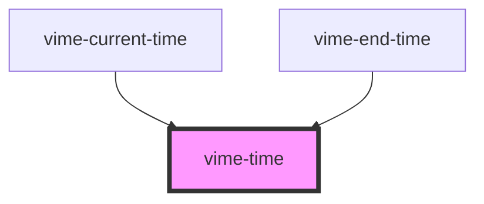

# vime-time

Formats and displays a length of time provided in seconds.

## Example

```html
<vime-player>
  <!-- ... -->
  <vime-ui>
    <!-- ... -->
    <vime-time label="Current time" seconds="120"></vime-time>
  </vime-ui>
</vime-player>
```

<!-- Auto Generated Below -->


## Properties

| Property             | Attribute           | Description                                                                                                           | Type      | Default     |
| -------------------- | ------------------- | --------------------------------------------------------------------------------------------------------------------- | --------- | ----------- |
| `alwaysShowHours`    | `always-show-hours` | Whether the time should always show the hours unit, even if the time is less than 1 hour (eg: `20:35` -> `00:20:35`). | `boolean` | `false`     |
| `label` _(required)_ | `label`             | The `aria-label` property of the time.                                                                                | `string`  | `undefined` |
| `seconds`            | `seconds`           | The length of time in seconds.                                                                                        | `number`  | `0`         |


## CSS Custom Properties

| Name                 | Description                                 |
| -------------------- | ------------------------------------------- |
| `--time-color`       | The color of the text displaying the time.  |
| `--time-font-size`   | The size of the font displaying the time.   |
| `--time-font-weight` | The weight of the font displaying the time. |


## Dependencies

### Used by

 - [vime-current-time](../current-time)
 - [vime-end-time](../end-time)

### Graph


----------------------------------------------

*Built with [StencilJS](https://stenciljs.com/)*
