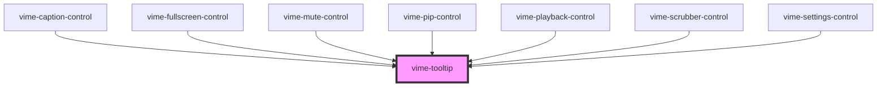

# vime-tooltip

A small pop-up box that appears when a user moves their mouse over an element. Their main purpose
is to provide a description about the function of that element.

## Visual


<!-- Auto Generated Below -->

## Usage

### Angular

```html {7} title="example.html"
<vime-player>
  <!-- ... -->
  <vime-ui>
    <!-- ... -->
    <vime-controls>
      <vime-control>
        <vime-tooltip>Title</vime-tooltip>
      </vime-control>
    </vime-controls>
  </vime-ui>
</vime-player>
```

### Html

```html {7}
<vime-player>
  <!-- ... -->
  <vime-ui>
    <!-- ... -->
    <vime-controls>
      <vime-control>
        <vime-tooltip>Title</vime-tooltip>
      </vime-control>
    </vime-controls>
  </vime-ui>
</vime-player>
```

### React

```tsx {7,18}
import React from 'react';
import {
  VimePlayer,
  VimeUi,
  VimeControls,
  VimeControl,
  VimeTooltip,
} from '@vime/react';

function Example() {
  return render(
    <VimePlayer>
      {/* ... */}
      <VimeUi>
        {/* ... */}
        <VimeControls>
          <VimeControl>
            <VimeTooltip>Title</VimeTooltip>
          </VimeControl>
        </VimeControls>
      </VimeUi>
    </VimePlayer>
  );
}
```

### Svelte

```html {7,19} title="example.svelte"
<VimePlayer>
  <!-- ... -->
  <VimeUi>
    <!-- ... -->
    <VimeControls>
      <VimeControl>
        <VimeTooltip>Title</VimeTooltip>
      </VimeControl>
    </VimeControls>
  </VimeUi>
</VimePlayer>

<script lang="ts">
  import {
    VimePlayer,
    VimeUi,
    VimeControls,
    VimeControl,
    VimeTooltip,
  } from '@vime/svelte';
</script>
```

### Vue

```html {8,21,30} title="example.vue"
<template>
  <VimePlayer>
    <!-- ... -->
    <VimeUi>
      <!-- ... -->
      <VimeControls>
        <VimeControl>
          <VimeTooltip>Title</VimeTooltip>
        </VimeControl>
      </VimeControls>
    </VimeUi>
  </VimePlayer>
</template>

<script>
  import {
    VimePlayer,
    VimeUi,
    VimeControls,
    VimeControl,
    VimeTooltip,
  } from '@vime/vue';

  export default {
    components: {
      VimePlayer,
      VimeUi,
      VimeControls,
      VimeControl,
      VimeTooltip,
    },
  };
</script>
```

## Properties

| Property    | Attribute   | Description                                                                                                                           | Type                             | Default     |
| ----------- | ----------- | ------------------------------------------------------------------------------------------------------------------------------------- | -------------------------------- | ----------- |
| `active`    | `active`    | Whether the tooltip is visible or not.                                                                                                | `boolean`                        | `false`     |
| `direction` | `direction` | Determines if the tooltip should grow according to its contents to the left/right. By default content grows outwards from the center. | `"left" \| "right" \| undefined` | `undefined` |
| `hidden`    | `hidden`    | Whether the tooltip is displayed or not.                                                                                              | `boolean`                        | `false`     |
| `position`  | `position`  | Determines if the tooltip appears on top/bottom of it's parent.                                                                       | `"bottom" \| "top"`              | `'top'`     |

## Slots

| Slot | Description                                  |
| ---- | -------------------------------------------- |
|      | Used to pass in the contents of the tooltip. |

## CSS Custom Properties

| Name                         | Description                                                      |
| ---------------------------- | ---------------------------------------------------------------- |
| `--tooltip-bg`               | The background color of the tooltip.                             |
| `--tooltip-border-radius`    | The border radius of the tooltip.                                |
| `--tooltip-box-shadow`       | The box shadow cast around the tooltip.                          |
| `--tooltip-color`            | The text color of the tooltip.                                   |
| `--tooltip-fade-duration`    | The length in seconds that the tooltip will take to fade in/out. |
| `--tooltip-fade-timing-func` | The transition timing function for fading in and out.            |
| `--tooltip-font-size`        | The font size of the tooltip text.                               |
| `--tooltip-padding`          | The padding inside the tooltip.                                  |
| `--tooltip-spacing`          | The space between the tooltip and its parent when active.        |

## Dependencies

### Used by

- [vime-caption-control](../controls/caption-control)
- [vime-fullscreen-control](../controls/fullscreen-control)
- [vime-mute-control](../controls/mute-control)
- [vime-pip-control](../controls/pip-control)
- [vime-playback-control](../controls/playback-control)
- [vime-scrubber-control](../controls/scrubber-control)
- [vime-settings-control](../controls/settings-control)

### Graph



---

_Built with [StencilJS](https://stenciljs.com/)_
