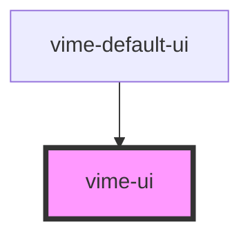

# vime-ui

Simple container that holds a collection of user interface components.

The only important role this component really has is, avoiding overlapping custom UI with the
native iOS media player UI. Therefore, custom UI is only displayed on iOS if the `playsinline` prop
is `true`, and the player is not in fullscreen mode.

<!-- Auto Generated Below -->


## Usage

### Angular

```html {3-5} title="example.html"
<vime-player>
  <!-- ... -->
  <vime-ui>
    <!-- ... -->
  </vime-ui>
</vime-player>
```


### Html

```html {3-5}
<vime-player>
  <!-- ... -->
  <vime-ui>
    <!-- ... -->
  </vime-ui>
</vime-player>
```


### React

```tsx {2,8}
import React from 'react';
import { VimePlayer, VimeUi } from '@vime/react';

function Example() {
  return (
    <VimePlayer>
      {/* ... */}
      <VimeUi>{/* ... */}</VimeUi>
    </VimePlayer>
  );
}
```


### Stencil

```tsx {6}
class Example {
  render() {
    return (
      <vime-player>
        {/* ... */}
        <vime-ui>{/* ... */}</vime-ui>
      </vime-player>
    );
  }
}
```


### Svelte

```html {3-5,9} title="example.svelte"
<VimePlayer>
  <!-- ... -->
  <VimeUi>
    <!-- ... -->
  </VimeUi>
</VimePlayer>

<script lang="ts">
  import { VimePlayer, VimeUi } from '@vime/svelte';
</script>
```


### Vue

```html {4-6,11,16} title="example.vue"
<template>
  <VimePlayer>
    <!-- ... -->
    <VimeUi>
      <!-- ... -->
    </VimeUi>
  </VimePlayer>
</template>

<script>
  import { VimePlayer, VimeUi } from '@vime/vue';

  export default {
    components: {
      VimePlayer,
      VimeUi,
    },
  };
</script>
```


## Slots

| Slot | Description                                   |
| ---- | --------------------------------------------- |
|      | Used to pass in UI components for the player. |


## CSS Custom Properties

| Name              | Description                                              |
| ----------------- | -------------------------------------------------------- |
| `--vm-ui-z-index` | The position in the root z-axis stack inside the player. |


## Dependencies

### Used by

 - [vime-default-ui](../default-ui)

### Graph


----------------------------------------------

*Built with [StencilJS](https://stenciljs.com/)*
