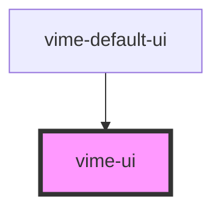

# vime-ui

Simple container that holds a collection of user interface components.

The only important role this component really has is, avoiding overlapping custom UI with the 
native iOS media player UI. Therefore, custom UI is only displayed on iOS if the `playsinline` prop 
is `true`, and the player is not in fullscreen mode.

## Example

```html
<vime-player>
  <!-- ... -->

  <vime-ui>
    <vime-poster />
    <!-- ... -->
  </vime-ui>
</vime-player>
```

<!-- Auto Generated Below -->


## Dependencies

### Used by

 - [vime-default-ui](../default-ui)

### Graph


----------------------------------------------

*Built with [StencilJS](https://stenciljs.com/)*
