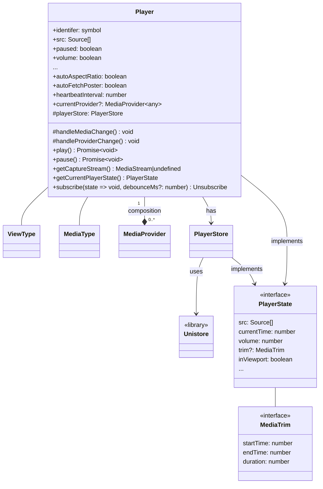
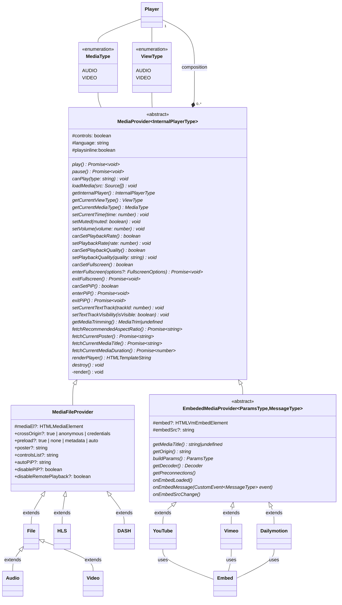
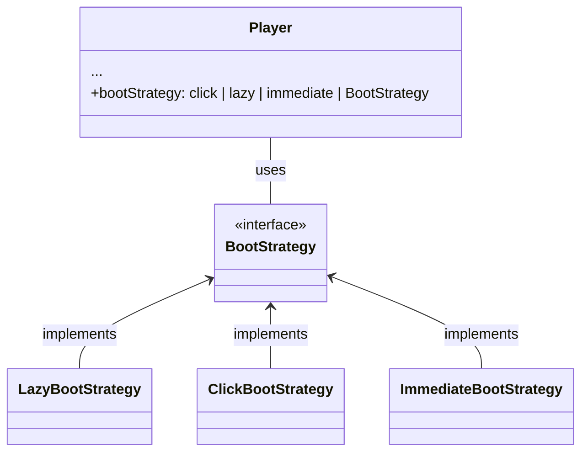
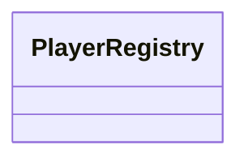
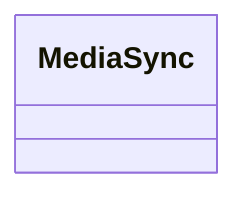

# Architecture

## Player

### Why `PlayerStore`?

- It provides an easy way to share/save/sync a snapshot of the state of the player at any time.
- Easy to subscribe to changes over-time instead of using multiple event listeners. 
- Easy to time travel and view the state of the player at any time in the past, simply push state 
as it comes through on to a stack.
- The state object is a fresh clone each time it's changed so it's safe for the consumer to mess with.
- Easier to consume from client side when building UI with React Hooks, Svelte Stores or Vue 
Composition API.

## Providers

The player will manage as much functionality as possible to avoid colliding with the provider and for 
consistency. This includes features like `autoplay`, `loop` and even rendering. The provider doesn't 
render anything by default. This enables the Player more control over when it happens opening up 
new features such as the ability to pass in multiple providers in the DOM at the same time 
(player can select provider based on who can play current `src`), and it allows different 
[boot strategies](#boot-strategy) to be used to determine how/when the provider is loaded.

## Boot Strategy

## Player Management

## MediaSync

## UI

## Player Update Flow

Using setting the `paused` property to `false` as an example:

- Provider updates the prop -> Player listens for `ProviderPlay` event and updates prop in the 
`PlayerStore`.
- UI updates the prop -> Player listens for `UIPlay` event and updates prop in the 
`PlayerStore` + calls `setPaused(false)` on `currentProvider`. 
- Developer updates prop -> Change is noticed through prop setter and it updates prop in the 
`PlayerStore` + calls `setPaused` on `currentProvider`. A `DevPlay` event may be emitted?

Note: When you are "getting" a property value from the `Player` that is part of `PlayerState` you 
are actually just returning the current value from the `PlayerStore`.

## Questions/Thoughts

- How to handle readonly properties??
- Strict naming convention? paused vs. isPaused?
- Show flows between Player -> Providers
- Show flows between Player → UI.
- Show flows between I18N → UI.
- Show cross component comms Controls → Captions/Settings (Collision detection).
- PlayerEventListener API.
- List all events (System/User) for Furf to make sure we've covered everything.
- Show UI Design patterns (Functional / CSS Classes / Toggle).
- Custom UI on IOS using Canvas?
- Custom PIP mode with Canvas?
- Stream chunks to indexdb?? Maybe save content as part of a session that can be cleared whenever?
- Offline mode? -> OfflineStrategy? -> save for another day?
- Caching -> CacheStrategy?
- Media Session?
- Playlists?? -> most likely external
- Ads? -> What happens to some UI when Ad playing?